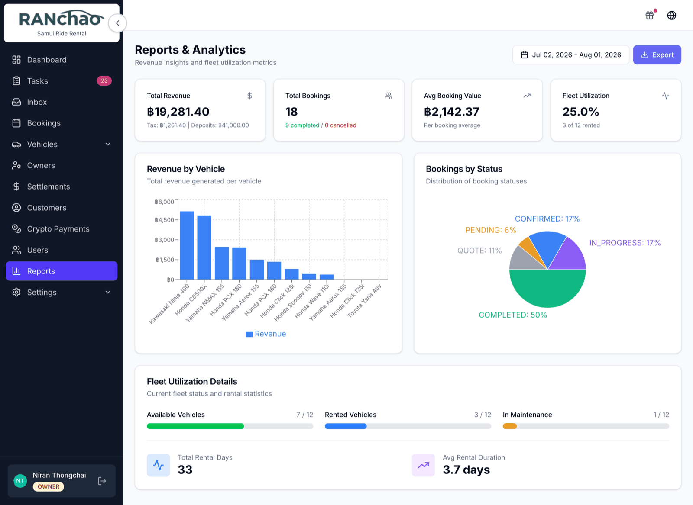
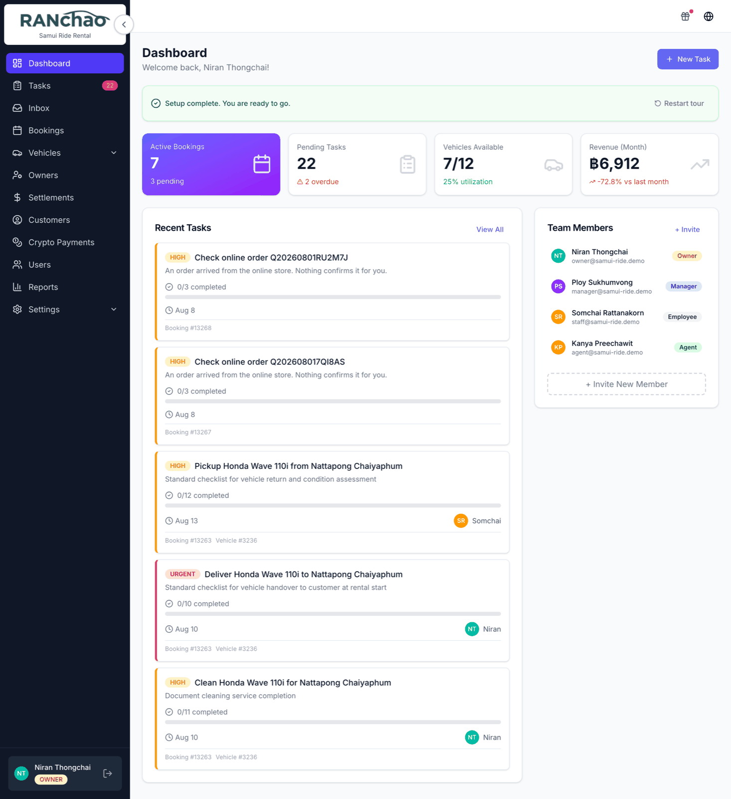

# What the platform does

Ranchao runs the operational side of a small rental or tour business: what you
own, who booked it, who is doing the work today, and how you get paid. One
account is one shop. Everyone in your shop logs into the same account with
their own user.

This page is the map. The other pages are the walkthroughs.

---

## Pick what you run

At sign-up you choose one of three **verticals**, and that choice decides which
menu items exist for you:

| You run | You get | Your daily object |
|---|---|---|
| **Vehicle rental** | Fleet, Partners, Maintenance, Expenses, Owners, Settlements | A booking against a scooter or car |
| **Property rental** | Properties, Owners, Settlements | A booking against a villa, apartment or room |
| **Trips & tours** | Trips (a per-day passenger manifest), Fleet & Destinations, Trips & pricing | A trip day, with people assigned to boats or vans |

You are not locked in. **Settings → Plan & billing → What you run** lets you
switch a vertical on or off later. Trips requires the Business plan; the two
rental verticals are on every plan.

Everyone, on every vertical, also gets: Dashboard, Tasks, Bookings, Customers,
Users, Reports and Settings.

> **If you run trips or properties**, the Dashboard and Reports follow your
> vertical, including the revenue breakdown: which villas earn, which trips
> earn. Trips break down **by destination**, not by boat, because what you sell
> is "Ko Tao", not "boat number three". Run more than one vertical and you get
> one breakdown per vertical, side by side.

---

## Who can see what

There are five roles. An owner can invite any of them, including another owner;
a manager can invite agents and employees only.

| Role | What they see |
|---|---|
| **Owner** | Everything, including Settings, Outreach and Lead-gen |
| **Manager** | Everything operational. No Settings, no Outreach, no Lead-gen |
| **Agent** | Dashboard, Tasks, Trips, Inbox, Bookings, Customers. Their own bookings only |
| **Employee** | Dashboard and Tasks only |
| **Vehicle Owner** | Dashboard and Reports only |

The practical split: an **Owner** configures the shop, a **Manager** runs it, an
**Agent** sells, an **Employee** does the jobs on the ground.

Only the Owner can open Settings. If a manager says "I can't find where to
change the payment details", that is why.

---

## On a phone

Most of the day happens on a phone, so the layout changes below 768px wide.

**Bottom bar:** Tasks, then Inbox / Outreach / Shop if you have them, then a
**Rentals** button, then **More**.

- **Rentals** opens a grid with Bookings, Trips, Vehicles, Owners, Partners,
  Settlements, Properties, Customers.
- **More** holds Dashboard, Crypto Payments, Users, Reports, Settings, the
  language switch and your account.

Three things worth knowing when you plan somebody's day around a phone:

- **Dashboard lives under More**, not on the bottom bar.
- **Maintenance and Expenses are desktop screens.**

So: the jobs on the ground run from a phone, and the office half hour runs from
a computer. The guided setup tour follows the same split — it starts by itself
on desktop, and on a phone you start it from the **Get started** card on the
Dashboard.

---

## The four numbers on the Dashboard

| Tile | What it counts |
|---|---|
| **Active Bookings** | Bookings that are Confirmed or In progress. The smaller line counts Pending |
| **Pending Tasks** | Tasks that are To do or In progress. "Overdue" is that same set past its due date |
| **Vehicles available** / **Properties available** / **Trips today** | Whichever fits what you run. Vehicles and properties show available out of total; trips shows today's departures and how many people are going |
| **Revenue (Month)** | The total of bookings marked Completed whose record was last touched this month |

Two things to know about that last one. It counts a booking on the date its
record was last edited rather than the date money arrived, so read it as a
direction of travel, not as your books. And the tiles are shop-wide for
everyone who can open the Dashboard — they are not filtered to the person
looking.

---

## Add-ons

The core product is the fleet, bookings, tasks and customers. Everything below
is bought separately, at **Settings → Plan & billing → Add-ons**.

| Add-on | ฿/month | What it gives you | How to get it |
|---|---|---|---|
| **Omnichannel inbox** | 990 | One inbox for WhatsApp, Telegram, Facebook, Instagram and email | Buy it yourself |
| **AI Assistant** | 590 | A bot that answers customer questions from your own knowledge base | Buy it yourself, Business plan |
| **AI booking bot** | 790 | Extends the assistant so it can quote and take orders | Buy it yourself, Business plan |
| **AI co-pilot** | 890 | Commands your staff type while handling a chat | Buy it yourself, Business plan |
| **Crypto payments** | 99 | Accept USDT on TRON | Buy it yourself |
| **Viator & TripAdvisor** | 1,490 | Sell your trips through Viator | Buy it yourself |
| **Outreach campaigns** | 490 | Cold outreach over your connected channels | Ask us to switch it on |
| **Lead-gen monitor** | 990 | Watch Telegram chats for buying intent | Ask us to switch it on |

Two things decide whether an add-on will actually do anything for you.

**None of the AI add-ons run without the Omnichannel inbox.** The assistant, the
booking bot and the co-pilot all read and write through the inbox, so if the
inbox is off they are switched off with it regardless of what you have paid for.
The Integrations page says so in an amber notice if you get there first.

**Outreach and Lead-gen are not in the self-serve list.** They are switched on
for you on request, because both send messages from your own accounts and both
need a short conversation about how to do that without getting a number banned.

On a free trial the inbox, the AI assistant, the booking bot, the co-pilot and
crypto are switched on automatically so you can try them. Outreach, lead-gen and
Viator are never auto-granted.

---

## Where to go next

- [A day with vehicle rental](02-day-vehicle-rental.md)
- [A day with trips and tours](03-day-trips.md)
- [A day with property rental](04-day-property.md)
- [A day as the owner](05-day-owner.md)
- [Getting paid](06-getting-paid.md): including the card payment link
- [The inbox and the AI](07-inbox-and-ai.md)
- [Plans, the trial, and getting into your account](10-plans-trial-and-accounts.md)
