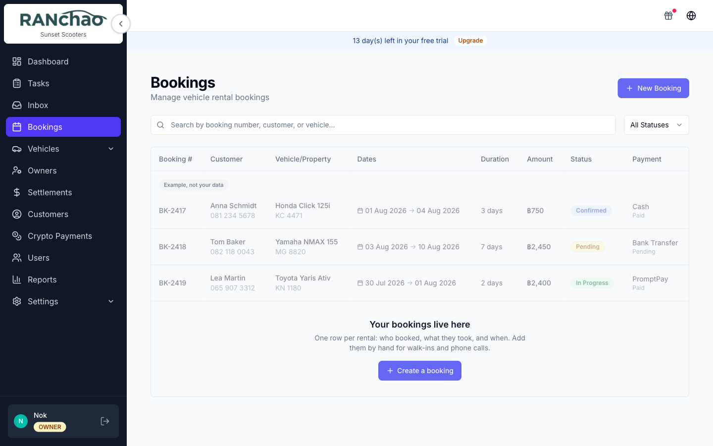

# A day with vehicle rental

Written for a **manager**: the person who opens the shop, takes the bookings and
gets the scooters out. Owner-only screens are marked so you know when to ask.

---

## Before the first day: the fleet

**Vehicles → Fleet → Add Vehicle.** Five things are required: brand and model,
plate number, year, and the price per day. The brand-and-model box is a search
against a catalogue, so type the first few letters and pick from the list. If
your model is not in it, choose the custom entry at the bottom of the dropdown
and type it yourself.

Everything else, photos, weekly and monthly rates, mileage, who owns it, can
be filled in later and does not stop the vehicle being bookable.

A vehicle has a status: Available, Rented, Maintenance. The Dashboard's
"Vehicles Available" tile counts the first one.

---

## Morning: what is on today

Open the **Dashboard**. Four numbers: active bookings, pending tasks, vehicles
available, revenue this month.

Then **Tasks**. This is the actual to-do list of the shop, and it is where the
day is run from. On a phone it is your first tab.

---

## A customer walks in

**Bookings → New Booking.**

You need a customer before you can save. If they are new, create them inline on
the form: first name and phone are enough. Then pick the vehicle, the dates and
the daily rate. A deposit is optional.

Save, and the booking exists as **Pending**.

### Confirming it

Open the booking and press **Confirm**. This is the step that matters
operationally, because confirming is what creates the work:

| Task | Priority | Due |
|---|---|---|
| Clean *(vehicle)* for *(customer)* | High | Start date |
| Deliver *(vehicle)* to *(customer)* | Urgent | Start date |
| Pickup *(vehicle)* from *(customer)* | High | End date |

Each comes with a checklist from your templates. Which tasks appear, and what
they are called, is configurable: see **Settings → Task checklists**. Leave it
alone and you get the three above.

**These are created with nobody attached, on purpose.** Everyone on your team
sees unclaimed work, and **starting a task claims it**, so two people cannot end
up cleaning the same scooter. That is the normal flow: the board is the shop's,
you take the next job, and after you take it, it is yours.

Assign one yourself when you want a specific person on it. Owners and managers
also get an **Unassigned** filter on the Tasks page, for when you want to see
what nobody has picked up.

A booking that gets confirmed by a payment (a card link or crypto) creates the
same tasks. And re-confirming does not duplicate them: anything already there is
left alone and only the missing ones are created.

---

## Through the day

**Start** moves a confirmed booking to In progress when the customer takes the
vehicle. **Extend** changes the dates. **Terminate Early** shortens it.

**Terminate Early keeps what it replaced.** It rewrites the end date and the
totals to match the shorter rental, and it keeps the originals: the booking then
shows "Ended early on the 5th. Originally ran to the 12th, worth ฿2,500." That
line is the answer when a customer argues about the refund a week later.

**Process Return** closes it out: it records the actual return date, works out
late days and a late fee, and moves the booking to Completed, or Returned late.

It also sets the vehicle back to **Available** and records how much of the
deposit was kept against the late fee and how much goes back.

**Cancel closes things rather than deleting them.** Open tasks are closed with a
note saying the booking was cancelled, finished ones are left alone, and unpaid
instalments are marked cancelled. An instalment that was already paid is never
touched: it is a record that money changed hands.

---

## Tasks, in practice

Statuses are To Do, In Progress and Done.

Open a task and you get up to three buttons: **Start Task**, **Complete Task**
(only once every required checklist item is ticked), and **Reset to Todo**.
Ticking any checklist item moves the task to In Progress by itself.

On a phone a task is a wizard instead: location, checklist, complete.

Move a task by opening it and pressing a button; the Kanban columns are a view,
not a drag-and-drop board.

Filters are All, My Tasks, Today and Overdue, plus **Unassigned** for owners
and managers, which is where the work nobody has picked up shows itself.
Employees do not get "All": they see only their own.

The Tasks list loads the newest 100 with no pagination. Past that, use the
filters.

---

## Money

Short version: create a card payment link from the booking page and send it, or
take cash and record it in your own books. The full picture, including what the
software reconciles by itself and what it does not, is in
[Getting paid](06-getting-paid.md).

---

## The rest of the vehicle menu

- **Partners**: companies you sub-rent from or to.
- **Maintenance**: service records per vehicle.
- **Expenses**: costs per vehicle.
- **Owners** and **Settlements**: third-party owners whose vehicles you manage,
  and what you owe them.

**Maintenance and Expenses have no entry point on a phone.** They are desktop
only. If your routine depends on them, do that part at a computer.

---

## What you cannot do as a manager

You can create, edit and delete vehicles, expenses, maintenance, bookings,
owners, partners and settlements; confirm bookings; invite and deactivate staff;
and create and assign tasks.

You cannot: open Settings, change anyone's role, set an agent's commission,
delete a property, or touch the AI assistant configuration. Those are the
owner's.
