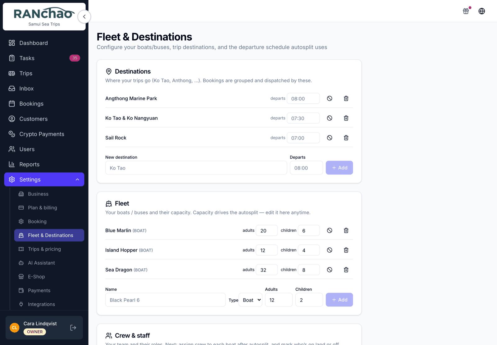
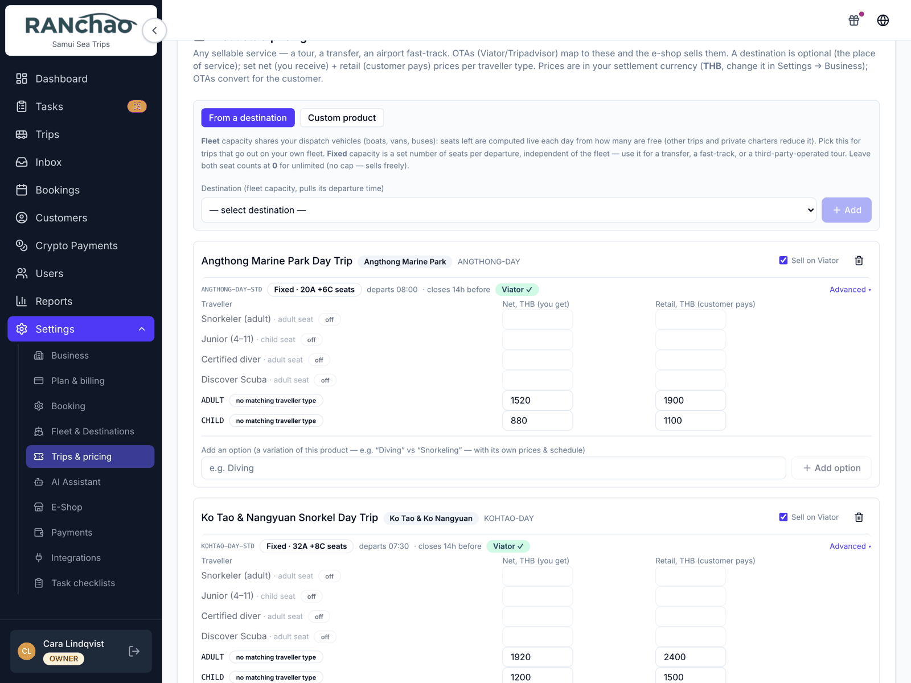
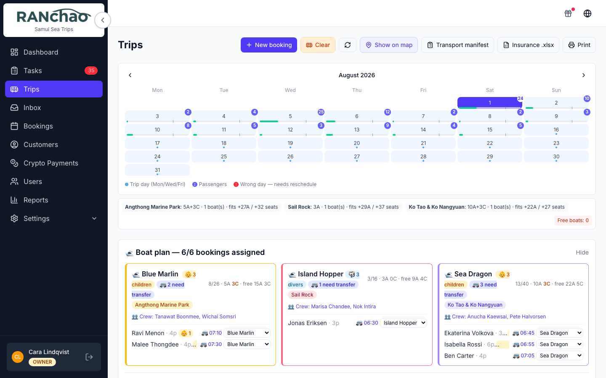
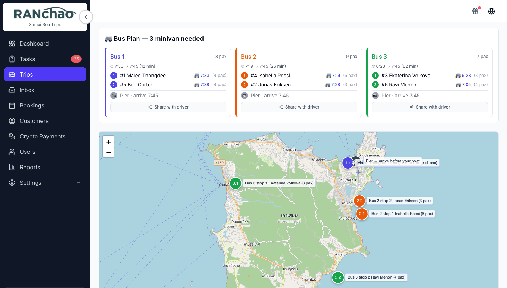
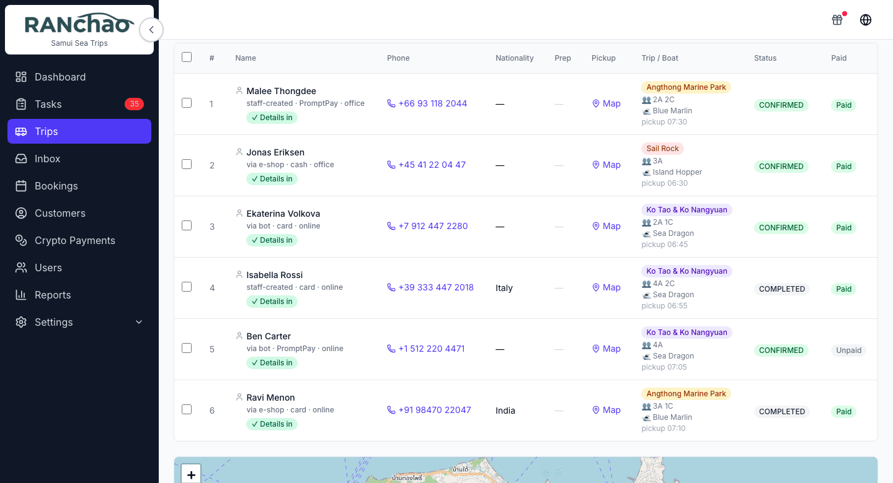
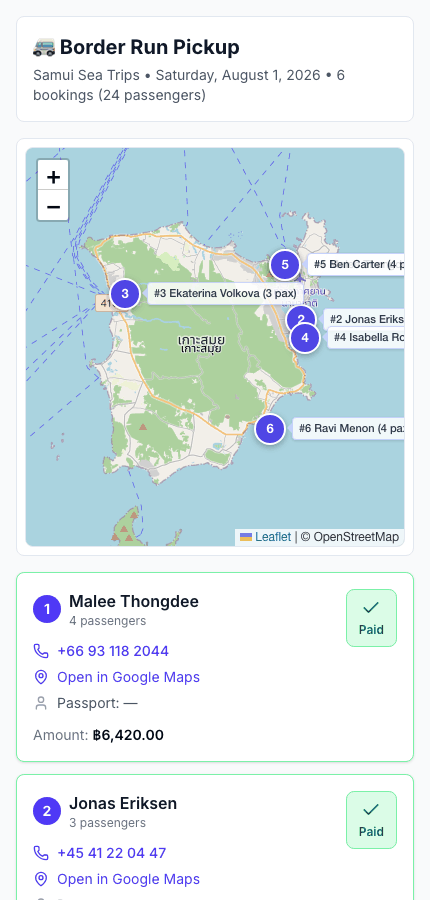
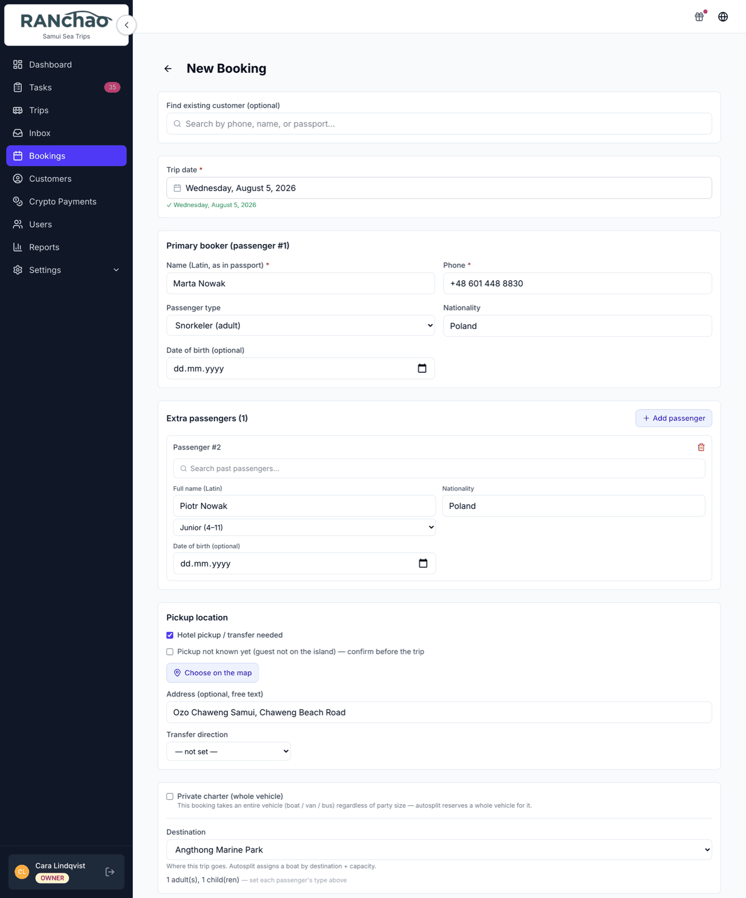
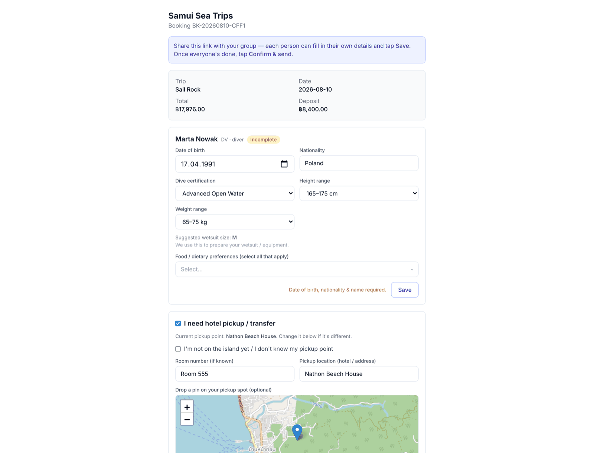

# A day with trips and tours

Written for the person running the departures: who is going today, on which
boat, and who still owes money.

The day itself runs from one screen, **Trips**. Three things have to exist
before a seat can be sold, and they depend on each other in order.

---

## Before the first departure: three things, in order

All three live under **Settings** and are owner-only.

**1. Where you go.** **Settings → Fleet & Destinations → Destinations.** An
island, a dive site, a border crossing. Everything else refers back to a
destination, so this is genuinely first.

**2. What you go in.** Same page, **Fleet**. Your boat, van or bus, and how many
people fit in it. The seat count is what lets the system tell you a departure is
full, and split guests across two boats when it is.

**3. What you sell and for how much.** **Settings → Trips & pricing → Products
& pricing.** A trip, with a price per kind of traveller. Two prices per kind:
what you keep, and what the guest pays. The gap between them is the commission a
booking site takes. Selling direct only? Put the same number in both.

The fastest route here is the **From a destination** option, which picks up the
destination you already created.

Also on that page, worth setting once: the days you actually run, the passenger
types you price for, and the guest booking form.

---

## The Trips page is your day

**Trips** in the menu. Pick a date and you get the manifest for it: everyone
booked, which boat or van they are on, and whether they have paid.

**Split people across boats.** Press **Autosplit** and boats fill up by the seat
counts you set. To move one person, use the dropdown next to them in the **Boat
plan** panel.

Autosplit then does a second pass you get for free: it groups everyone who needs
collecting into **minivans**, orders each van's stops, and works the pickup
times backwards from the departure time of the boat that van is feeding.

It plans from the pickup location on each booking, so a booking with no pickup
recorded is simply left out of the vans — which is right for a guest making
their own way to the pier, and a silent omission if you meant to collect them.
**Show on map** draws the same plan, one colour per van.

**Mark people paid.** Each row carries where the booking came from, how it was
paid, its status and whether the money has arrived.

On a computer the toggle opens a **Mark paid as…** menu:
*Cash — at office*, *Cash — to driver*, *PromptPay — at office*, *Bank transfer
— at office*. On a phone the toggle skips the menu and records
**Cash — at office**. If the money came another way, set it on a computer.

**Print** the manifest.

**Share with driver.** Select the rows first, then the button appears. It
produces a link the driver opens on their own phone with no login, valid for
**48 hours**: the day's pickups on a map, and a card per passenger with their
phone, a Google Maps link to the door, and whether they have paid.

Treat that link carefully: it does not only show the manifest, it lets whoever
holds it **mark passengers as paid**. Send it to your driver, not to a group
chat.

---

## Taking a booking

**Bookings → New Booking**, and if you run more than one vertical, pick the
**Trip** tab.

You need a customer (name and phone are enough, create them right on the form),
the destination, the date and the passenger breakdown.

**Confirm** creates one task, **Prepare trip to (destination) for (customer)**,
with a short checklist: passenger count, pickup point and time, and which boat
they are on. It arrives with nobody attached, so give it to somebody.

Want a different routine? **Settings → Task checklists** decides which
checklists are created automatically when a trip booking is confirmed.
Configure one and it replaces the built-in task rather than adding to it.

The day itself still runs from the Trips page, not the Tasks screen.

---

## The guest details form

A booking tells you who is coming and when. It does not tell you passport
numbers, dietary requirements or dive certifications, and chasing four
passengers for those over chat is most of the admin in this business.

So each booking can produce a **link the guest opens themselves**. They fill it
in on their own phone and the answers land back on the booking.

### Getting the link

Open the booking. In the right-hand column there is a card headed **Guest
details form** with a button, **Get guest-details link**. Press it once and you
get a URL, a copy button, and an open-in-new-tab button.

Send that URL however you already talk to the customer. Once they have
submitted, the card shows a green **Submitted** badge, so you can tell at a
glance whether you are still waiting.

**The link is the credential.** There is no login on it: anyone holding it can
open and edit that booking's guest details. Send it to your customer, not to a
group chat.

You can also open it yourself and fill it in for them, which is usually faster
when someone is standing in front of you reading their passport out.

### Choosing what it asks

**Settings → Trips & pricing → Guest booking form.** Three things to decide:

- **Dietary options.** One per line. There is a built-in list, but yours will
  differ, and this is the field guests actually notice. Write your real menu
  constraints here.
- **Dive certification options.** Only relevant if you run diving.
- **Collect passport details.** A switch. Turn it on for anything that crosses a
  border, off for a day trip where you do not need it. Asking for a passport
  number you have no use for is the fastest way to lose a form submission
  halfway through.

  It also applies when **you** take the booking: with the switch on, a passport
  number becomes required on the booking form, for the lead booker and for every
  extra passenger. Worth knowing before somebody is standing at your desk
  without their documents.

The form collects details; it does not take payment. The deposit appears on it
as a read-only figure. Money is a separate step: see
[Getting paid](06-getting-paid.md).

---

## Selling through Viator and Bokun

Both are under **Settings → Integrations**, as extra tabs that appear only for
this vertical.

**Viator** is a separate paid add-on. Bookings that come in through it
arrive already confirmed.

Set your **net** and **retail** prices properly before you connect anything: the
difference between them is what the channel takes, and a wrong number there is a
wrong number on every seat you sell.

---

## Money

Cash goes through the paid toggle on the Trips page. Card links, crypto,
PromptPay and what does or does not reconcile itself are all in
[Getting paid](06-getting-paid.md).

Two things specific to trips:

- **Deposits are computed for you:** half the total, capped at ฿50,000. It is
  not configurable.
- **A border-run booking produces a PDF ticket after payment.** It is the only
  document the platform generates, and its heading is fixed rather than your
  shop name.

---

## Where the rest of it lives

- **Your boats are in Settings → Fleet & Destinations.** There is no Vehicles,
  Maintenance or Expenses menu on this vertical; those belong to vehicle rental.
- **Your revenue breakdown is by destination**, not by boat, because what you
  sell is "Ko Tao", not "boat number three". The Dashboard tiles and the Reports
  breakdown follow the vertical you run.
- **Boat priorities are optional.** The **Boat priorities** card on Settings →
  Fleet & Destinations lets you give a boat a preferred destination. It is a
  preference, not a lock: a boat bound to a destination with no demand today
  joins the general pool.
