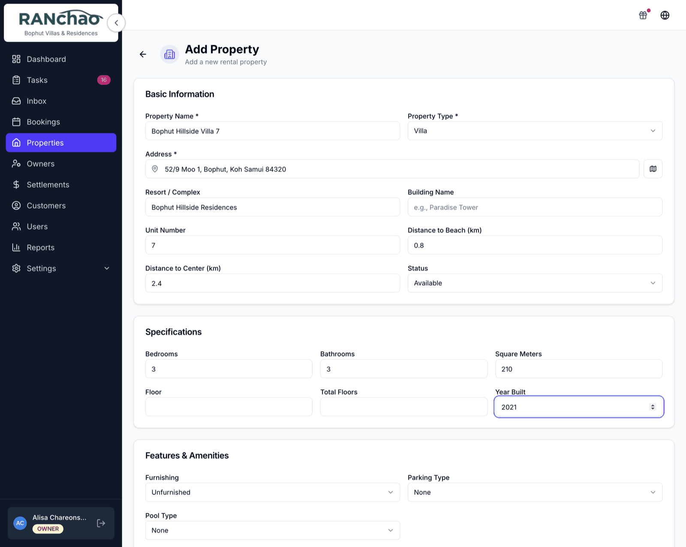
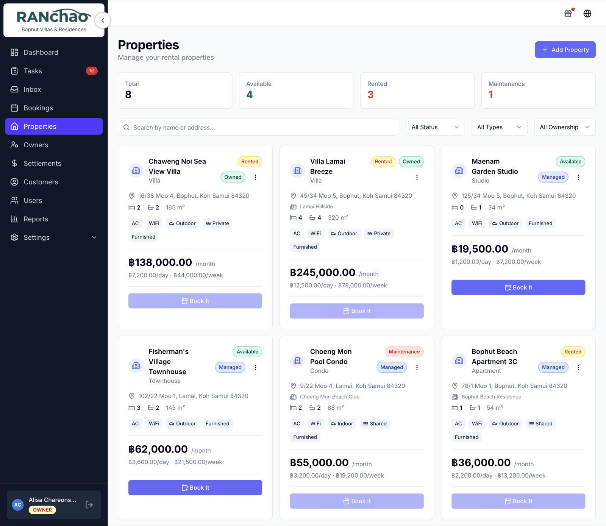
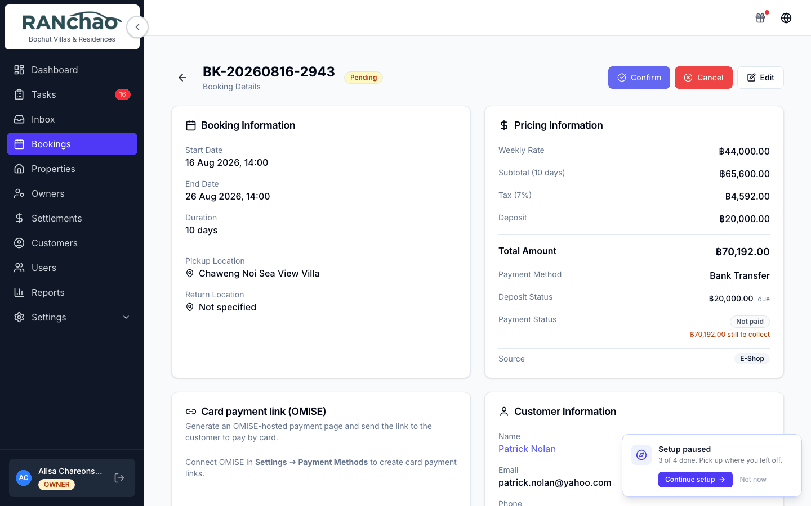
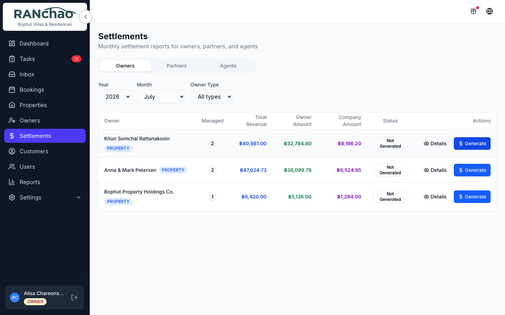

# A day with property rental

Written for the person handling arrivals and departures: getting the villa
ready, getting the guest in, and getting the keys back.

The shape is the same as vehicle rental: a thing you own, a booking against it,
and a short list of jobs that appears when you confirm.

---

## Before the first guest: put the properties in

**Properties → Add Property.** Two things are required to start taking
bookings: the **name** and the nightly rate, which the form labels
**Daily Rate**.

The form is long because it can describe anything from a single room to a
villa: type, resort or complex, building, unit number, distance to the beach and
to the centre, bedrooms, bathrooms, amenities, rules, photos. None of it blocks
you. Fill in the name and the rate, save, and come back to the rest when you
have time.

---

## A booking

**Bookings → New Booking**, and pick the **Property** tab if you run more than
one vertical.

Create the customer right on the form if they are new (first name and phone),
then the property, the dates and the nightly rate. A deposit is optional.

### Confirming it

Press **Confirm** and three jobs appear:

| Task | Priority | Due |
|---|---|---|
| Prepare *(property)* for *(guest)* | High | Check-in date |
| Check-in *(guest)* at *(property)* | Urgent | Check-in date |
| Check-out *(guest)* from *(property)* | High | Check-out date |

Each carries a checklist from your templates, which is where a housekeeping
standard actually lives. Edit them at **Settings → Task checklists** (owner
only). That page also decides which tasks are created at all, and what they are
called.

**They are created with nobody attached, on purpose.** Everyone on your team
sees unclaimed work, and starting a task claims it, so two people cannot both
turn up to clean the same villa. Assign one yourself when you want a specific
person on it.

A booking confirmed by a payment (card link or crypto) creates the same tasks.

---

## Arrival and departure

**Start** when the guest checks in.

**Process Return** when they check out. It records the actual date, works out
late days and a late fee if there are any, completes the booking, and records
how much of the deposit was kept and how much goes back.

**Cancel closes things rather than deleting them.** Open tasks are closed with a
note, finished ones are left alone, and unpaid instalments are marked cancelled.
Anything already paid is never touched.

---

## Long stays

A booking marked long-term with a monthly rate gets a **payment schedule**: a
card on the booking with a **Record Payment** button, an amount, a method and a
note.

Saving a long-term booking without a deposit shows a warning and lets you
continue.

---

## Money

Card link, PromptPay, bank transfer, crypto, cash: see
[Getting paid](06-getting-paid.md). Two things to carry into this vertical:

- On a short booking there is **no cash-recording button**. The Payment Method
  dropdown on the form is a label for what you expect, not a record that money
  arrived. Long stays are the exception: **Record Payment**, above.
- A payment slip uploaded through the online store waits for you on the booking:
  look at the image and press **Approve payment** or **Reject** with a reason.
  Owner and manager only, and on a computer — the mobile booking page shows the
  slip but not the buttons.

---

## Owners and settlements

If you manage properties for other people, **Owners** is where you record them
and the split you have agreed, and a property is linked to its owner on the
property itself.

**Settlements** then produces a monthly statement per owner: pick the month,
press **Generate**, and you get what each owner's villas earned, their share and
yours.

A completed stay counts in the month it happened, split across two months when
it straddles them. A long stay counts the instalments actually **paid**, so a
month the guest has not settled never lands on an owner's statement as money you
owe.

Only the owner of the account can delete a property. A manager can do everything
else with it.

---

## Where the rest of it lives

- **There is no Vehicles, Maintenance or Expenses page** on this vertical; those
  belong to vehicle rental. Track property maintenance costs outside the
  platform.
- **The Dashboard tiles and the Reports breakdown follow the vertical you run**,
  so you get properties where a rental shop gets scooters. Run both and you get
  both, side by side.
