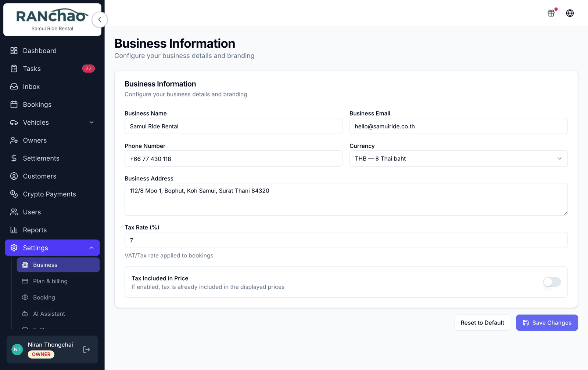
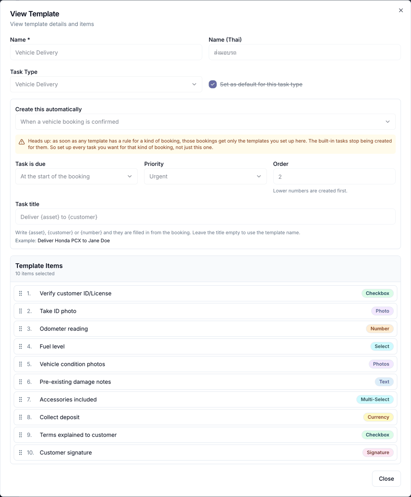
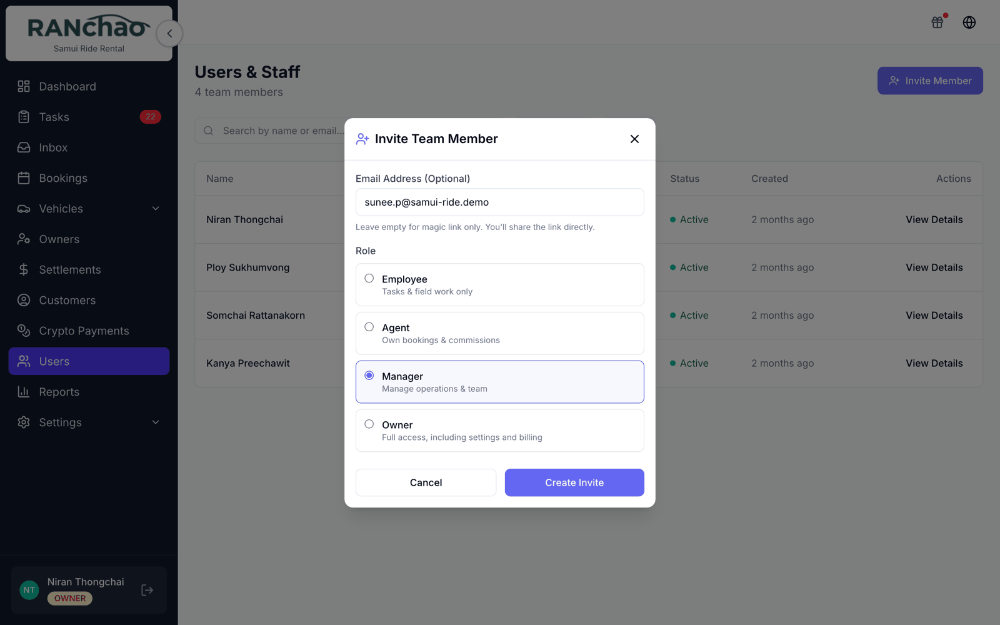
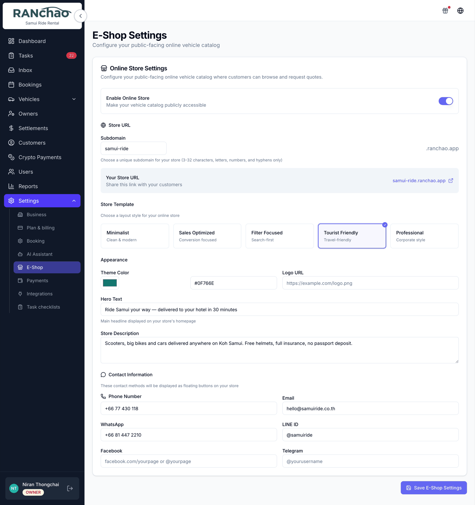
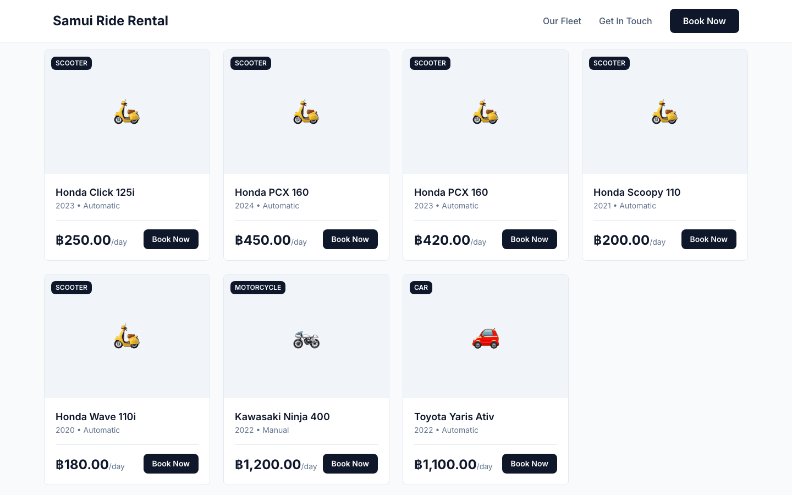

# A day as the owner

The other "day in the life" pages cover running the shop. This one is the
business: setting it up, deciding what it sells, buying the capability you need,
and watching the money.

You are the only login that can open **Settings**. If a manager asks where to
change something, the answer is almost always "that is on your login".

---

## Week one: set the shop up

The **Get started** card on your Dashboard walks the first steps — four of them
for a rental shop. It tracks itself from real data, so a step ticks off when the
thing actually exists, not when you clicked past it.

Beyond it, the settings worth doing early.

### Settings → Business

Name, contact email and phone, address, currency.

Fill in the email and phone: they are what your online store shows and what the
chat assistant gives out when a customer asks how to reach you.

**Set the currency before you enter any prices.** Every amount in the back
office and on your storefront is shown in the currency you pick here, formatted
the way that currency is normally written. It changes how numbers are displayed,
not what they are: it will not convert prices you have already typed.

### Settings → Booking

One setting: the **Default Agent Commission** your agents earn.

### Settings → Payments

At minimum, decide whether you are taking cards and connect Omise if you are.
Everything else about money is in [Getting paid](06-getting-paid.md).

### Settings → Task checklists

This is where your operating standard lives. The checklist itself is the
difference between "clean the scooter" and a cleaner who knows what you mean.

Each template can say **when it is created automatically**: when a vehicle,
property or trip booking is confirmed, or when an order arrives from your online
store. Leave it alone and you get the built-in set for your vertical. Configure
one and it **replaces** the built-in set for that kind of booking rather than
adding to it, so if you set up one trip checklist, trips get exactly that one
task.

Tasks are created with nobody attached. That is deliberate: your team sees
unclaimed work, and starting a task claims it, so the board behaves like a
shared job list rather than a set of private inboxes.

---

## Bringing your team in

**Users → Invite.**

- **Manager**: runs the shop. Everything except Settings, Outreach and Lead-gen.
- **Agent**: sells. Sees their own bookings; can create bookings and customers.
- **Employee**: does the jobs. Dashboard and Tasks only.

Two things to know while you are here.

**Auto-created tasks belong to nobody until somebody starts them.** Your team
can see them and claim them by starting; assign one yourself when you want a
specific person on it. Owners and managers get an **Unassigned** filter on the
Tasks page to see what nobody has picked up.

**Role changes and commissions are yours alone.** A manager cannot change
anyone's role or set an agent's commission.

---

## Deciding what you sell

**Settings → Plan & billing → What you run.** Vehicle rental and property rental
are available on every plan. Trips & tours needs the Business plan.

Turning one on adds its menu items and its settings sections. They are not
mutually exclusive: run a fleet and properties from the same account if that is
your business.

---

## Buying capability

**Settings → Plan & billing → Add-ons.** The list, the prices and what each one
does are in [the overview](01-what-the-platform-does.md#add-ons).

One dependency decides whether an add-on does anything for you: **every AI
add-on requires the Omnichannel inbox.** Buying the assistant without the inbox
buys you nothing that runs. The Integrations page warns about this, but it is
worth knowing before you spend.

On a trial the inbox, both AI tiers, the co-pilot and crypto are switched on for
you. Outreach, lead-gen and Viator are not.

---

## Opening the online store

Off by default. Turn it on at **Settings → E-Shop**: enable it, pick your
subdomain, pick a template, set the theme colour and hero text.

Your customers get `https://yoursubdomain.ranchao.app`. The link is shown to you
on that page.

It publishes **what you sell, in whatever vertical you run**: vehicles marked
Available, properties marked Available, and trips that have a price. It follows
the verticals you actually have turned on, so a scooter shop never shows an
empty villa section. Prices are shown per day, per night or per person,
whichever the thing is sold by, in your own currency.

**The look is a setting, not a fixed design.** Settings → E-Shop offers several
templates, from a restrained one to a bright holiday style, plus your own theme
colour and hero text. The screenshot below is one of them — try a few and pick
the one that sounds like your shop.

Two things are deliberately left off, because a card with no price is worse than
no card: a property with no nightly rate, and a trip with no rate set. If
something is missing from your shop, that is the first thing to check.

### When an order arrives

It lands in your **Bookings** list as a **Quote**, and creates a task,
**Check online order Q20260801X7K4M2**, so it shows up in somebody's day rather
than sitting unseen. Nothing auto-confirms it.

To find it: the status filter has no **Quote** option, so look under **All
statuses** and spot the purple Quote badge. The **E-Shop** label appears once
you open the booking. If you switch the store on, put "check the bookings list"
into somebody's daily routine.

---

## Teaching the assistant

If you have bought the AI add-ons, **Settings → AI Assistant** is where you set
the bot's persona, its goal and its knowledge base. This is worth an hour of
your time: the bot answers only from what you write there and refuses to guess,
so a thin knowledge base produces a bot that constantly says it does not know.

Full detail, including how to take a conversation over from the bot and where
co-pilot commands go, is in [The inbox and the AI](07-inbox-and-ai.md).

---

## Watching the money

**Reports** covers revenue, bookings by status and fleet utilisation over a date
range.

The Dashboard's **Revenue (Month)** tile is an indicator rather than an
accounting figure: it sums bookings marked Completed whose record was last
modified this month, so it follows edits rather than payments.

**Settlements** is where you reconcile with vehicle or property owners, partners
and agents.

**Crypto Payments** is a read-only ledger of USDT taken and paid out.

---

## Growth tools

**Outreach** and **Lead-gen** are switched on by us on request rather than
bought at checkout, because both send from your own accounts and the pacing
matters more than the price. Both are owner-only.

### Outreach

Cold outreach over WhatsApp. You import contacts from a CSV, their reachability
is checked in the background, and you build a campaign in three steps: audience,
message, schedule.

The rate settings are the important part: a minimum gap between messages (the
wizard refuses anything under 30 seconds), a daily cap, and a sending window.
Write two or three variations of your message, because identical text sent to
many people is what gets a number flagged.

Replies land in your normal **Inbox** as ordinary conversations, and the AI bot
is deliberately kept out of them so a human answers a cold reply.

Two limits to plan around: there is **no opt-out or unsubscribe list**, so keep
your own; and the daily cap resets at midnight UTC, not your local midnight.

### Lead-gen

Watches Telegram group chats for people expressing buying intent, qualifies them
with the AI against a description of your product, and forwards the good ones
into a Telegram group of yours, plus a list in the app. It does not create
customers, tasks or inbox threads: leads arrive in that group and nowhere else.

### Referrals

**Bonus account**, in the top bar on desktop, is the referral programme. Your
link is `ranchao.app/signup?ref=YOURCODE`, and you earn **10% of everything a
tenant you referred pays, for their first year**. The person you referred gets
half their first month.

Credit comes off your next invoice automatically. Up to half of what you have
earned can be requested as a cash payout instead, from the same panel; that
sends us a request and we arrange it with you. Credit funded by card payments is
held for a while before it becomes withdrawable, since a card payment can be
reversed.

You can also pass credit to another operator as a gift code. Gifted credit is
spendable but never withdrawable.

---

## Before your trial runs out

Read
[Plans, the trial, and getting into your account](10-plans-trial-and-accounts.md).
When a trial expires your account goes read-only: everything still opens, but
nothing saves until you pick a plan.
