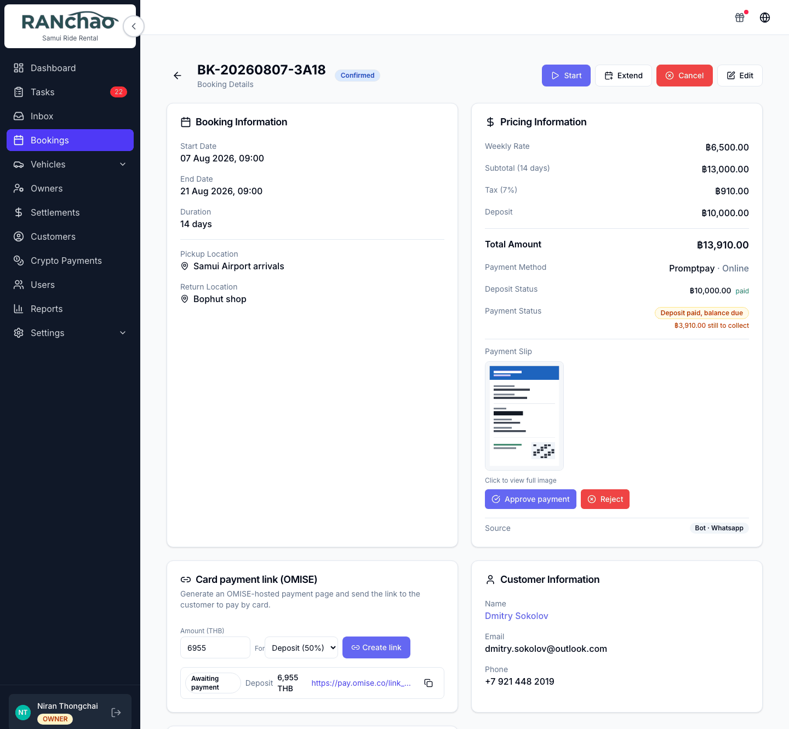
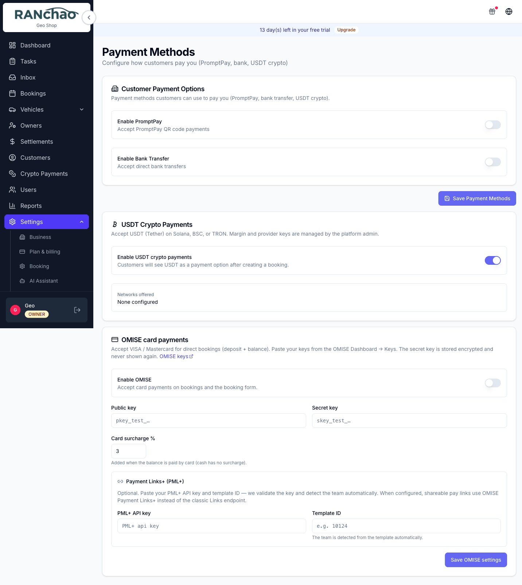
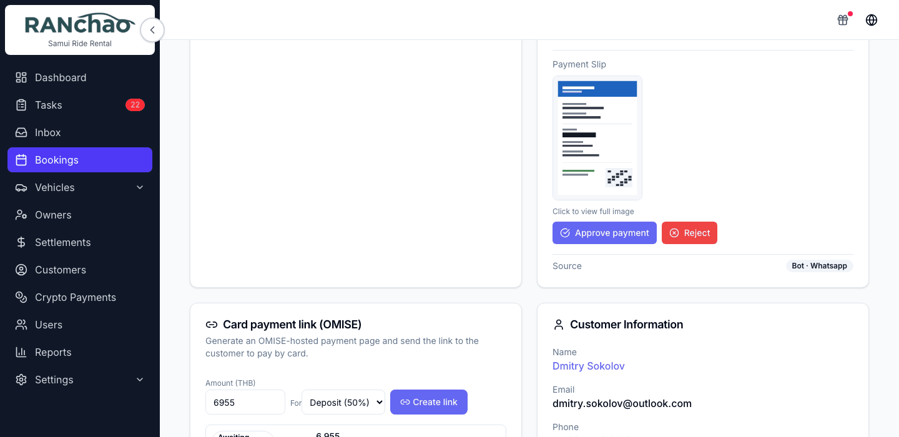

# Getting paid

Two questions run this page: **how do I ask a customer for money**, and **how do
I know it arrived**. The methods differ most on the second one.

| How they pay | You start it | Customer gets | Booking updates by itself |
|---|---|---|---|
| **Card link (Omise)** | Booking page | A link you send them | **Yes**, by webhook |
| **USDT crypto** | The chat bot offers it | Address + QR + amount | **Yes**, watched on-chain |
| **PromptPay** | Online store, or the bot | A QR with the amount in it | Only via the bot |
| **Bank transfer** | Online store only | Your account details | No |
| **Cash** | Trips page, or a long-term booking | Nothing | No |
| **Monthly instalments** | Booking page, long-term rentals | Nothing | No |

**Two of them reconcile themselves: the card link and crypto.** For everything
else, somebody has to look and confirm.

---

## Send a card payment link

The everyday way to charge a customer who is not standing in front of you.

**Where:** open the booking and scroll down. Under **Booking Information**, in
the left-hand column, there is a card headed **Card payment link (OMISE)**.
Desktop only: the panel is not on the mobile booking page. The card, and
everything on it, is in English whatever language you use.

**Connect Omise first.** Until you do, the card shows one line and no fields:

> Connect OMISE in Settings → Payment Methods to create card payment links.

Once connected you get an **Amount (THB)** field, a **For** dropdown with
*deposit (50%)* / *balance* / *full (100%)*, and a **Create link** button.

The amount prefills from the booking: the full total, the deposit, or the
remainder. **Create link starts disabled if that prefill is zero** — which
happens on a booking with no total and no deposit. Type an amount and it
enables.

Anyone who can open a booking can create a link, agents included.

### Nothing is sent to the customer

Pressing **Create link** creates the link and adds it to the list below with its
URL and a copy button. **No email, no chat message, no SMS goes out.** Copy the
URL and send it yourself, however you normally talk to that customer.

### When they pay

Omise calls us, we re-check the payment against Omise directly rather than
trusting the message, and then the booking is updated: the payment method
becomes card, the deposit is marked paid, and a *balance* or *full* link marks
the booking verified and moves it to Confirmed if it was a quote or pending.

Three things follow from that:

- **The panel refreshes itself** about once a minute while a link is still
  unpaid, and stops once everything has settled — so a link goes from
  *Awaiting payment* to *Paid* in front of you, without a reload.
- **A deposit shows as a deposit.** The badge has three states: *Not paid*,
  *Deposit paid, balance due*, and *Paid in full*. A deposit link moves it to
  the middle one, not the last.
- **A booking confirmed this way gets its preparation tasks.** They are created
  unassigned, like the ones from the **Confirm** button, so somebody still has
  to pick them up.

If a payment fails, nothing changes and you are not told. The link simply stays
*Awaiting payment*.

### The one booking you cannot bill

**A cancelled one.** The panel says so instead of offering the form, and the
server refuses it too, so a link cannot be made by going around the screen.

Everything else can be billed:

- a booking marked **returned late** is precisely the one that owes you a late
  fee;
- a **completed** long rental can still have an instalment outstanding;
- a booking already **paid in full** can acquire a damage charge after the fact.

### Connecting Omise

**Settings → Payments**, the last card on the page. Owner only.

You need your public key and secret key from the Omise dashboard. The secret is
encrypted and never shown again after saving. There is an optional **Payment
Links+** section — an API key and a template ID — if your Omise account has it.

**Test keys will connect but will not create links.** The card shows
*Connected* and *Test*, and then link creation fails against Omise's test
environment.

---

## PromptPay and bank transfer

**Settings → Payments**, top of the page: switch each on, then fill in the
details. PromptPay takes the number and the account name; bank transfer takes
bank name, account name, account number and branch.

You do not need to supply a QR image. One is generated from your PromptPay
number and previewed on the page. The **QR Code Image URL** field is there if
you want to use your own, but it is a **web address, not a file upload**: the
image has to be online somewhere already.

**Switching these on puts them on your online store**, and PromptPay also
appears in the chat bot's payment menu; bank transfer is store-only. There is no
PromptPay or bank-transfer button on the booking page in the operator app, so
with no store and no bot, switching them on changes
nothing a customer will see.

Where a customer does meet them:

- **Online store.** They pick a payment method and upload a payment slip. The
  slip appears on the booking as an image.
- **Chat bot.** It generates a QR with the exact amount already in it.

### Clearing a slip

A slip paid through the bot is checked automatically against the slip service
and the booking is marked verified.

A slip uploaded on the online store waits for you: open the booking, look at the
image, and press **Approve payment** or **Reject** with a reason.

The reason you give is kept on the booking for your own team; it is not sent
to the customer, so tell them yourself. If they upload a replacement, the old
rejection is cleared with it.

Owner and manager only, and **on a computer only**: the mobile booking page does
not have those controls.

---

## Crypto (USDT)

Requires the **Crypto payments** add-on.

The customer is offered USDT on TRON in the bot's payment menu and gets a
one-time address, a QR, the exact amount and a memo. The address is valid for
about 30 minutes, with a 24-hour grace period after that.

**Nobody has to ask for it and nobody has to check it.** The bot offers the
address, the chain is watched, and once the payment has enough confirmations the
booking is marked paid. A card link settles itself too, but somebody still has
to create it and send it; crypto is the one that runs end to end on its own.

Two things to know:

- A payment below **95%** of the amount shows as **Underpaid** and does not
  credit the booking.
- A late payment inside the grace window is recorded like an on-time one, so the
  page will not tell you it was late.

**Crypto Payments** in the menu is a read-only ledger: what customers paid you
in USDT and what has been paid out. There is no crypto button on a booking.

---

## Cash

There are exactly two places cash gets recorded.

**The Trips page.** Tap a passenger's paid toggle and pick from *Cash — at
office*, *Cash — to driver*, *PromptPay — at office*, *Bank transfer — at
office*. The menu is on the computer; **on a phone the toggle marks them paid
as "Cash — at office"** without asking. If the money actually came another way,
set it on a computer.

**Record Payment on a long-term booking.** A long-term booking with a monthly
rate has a payment schedule, and each instalment can be recorded with an amount,
a method (cash, card, bank transfer, PromptPay) and a note.

For an ordinary short rental **there is no "record cash payment" control.** The
booking form asks for the payment method you *expect*, which is a note about
what you think will happen, not a record that it did.

---

## Deposits

There is a **Deposit Amount (THB)** field on the booking form. It is optional
and blank by default. On a long-term rental, saving without one shows a warning
and lets you save anyway. There is no shop-wide default deposit: type it per
booking.

What the software tracks is whether the deposit was **paid**, and it learns
that from a card link, from crypto, from the trips paid toggle, or from a
marketplace like Viator or Bokun reporting the booking as paid.

**Process Return** records how much of the deposit was kept against a late fee
and how much goes back. Physically handing the money over is still yours to do.

---

## Instalments on long rentals

If a booking is long-term with a monthly rate, a payment schedule is created for
it and appears on the booking as its own card. **Record Payment** takes an
amount, a method and a note. Owner and manager only.

---

## Invoices, receipts and contracts

The platform does not generate an invoice, a receipt or a rental contract. There
is no PDF to send, no document to print, no invoice number, and no place to put
a tax ID. A quote taken through the online store produces a reference code on
screen and an entry in your bookings list, not a document. Paperwork your
customers need is written outside the platform.

The one PDF the system produces is a border-run trip ticket, generated after
payment for that specific product.
