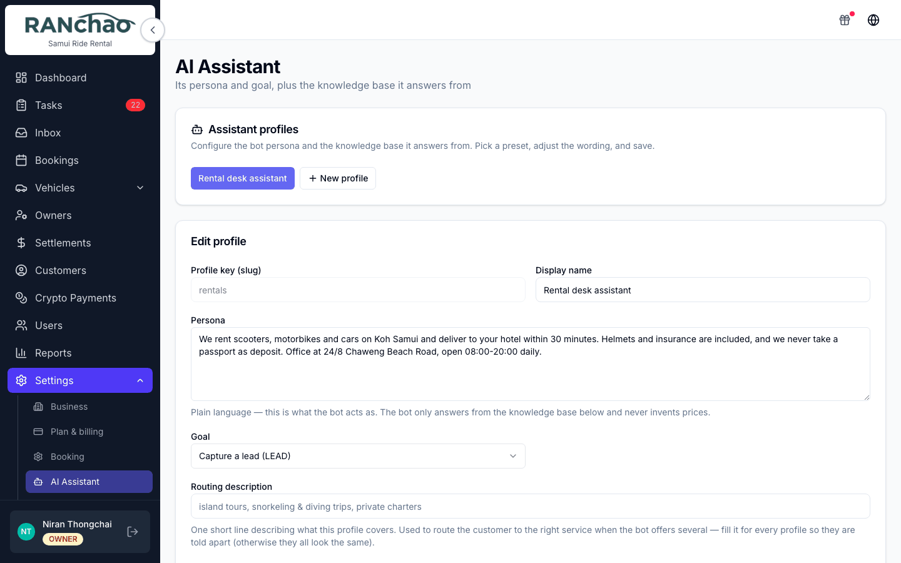
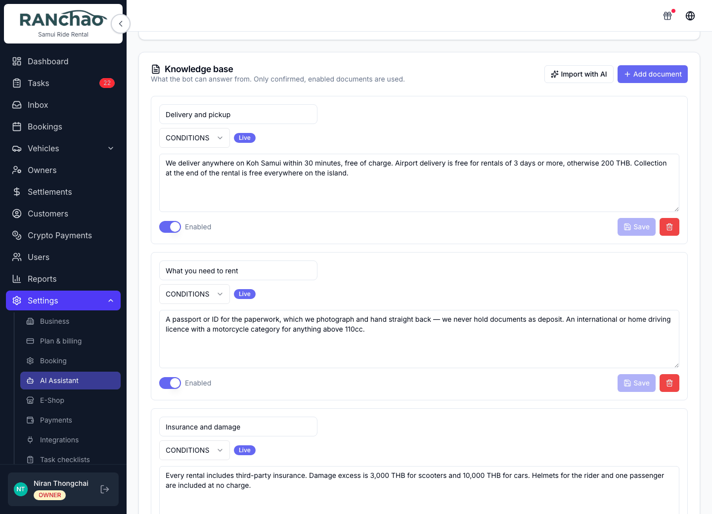
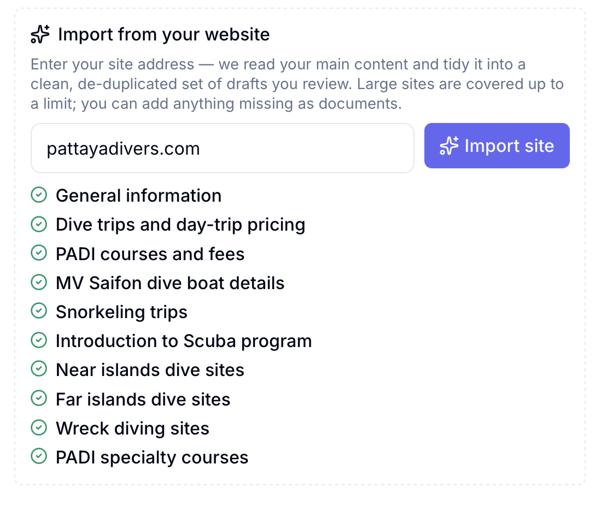

# The inbox, and where the AI writes

Requires the **Omnichannel inbox** add-on. Everything else on this page depends
on it: the AI assistant, the booking bot and the co-pilot are all switched off
if the inbox is off, no matter what else you have bought.

---

## What the Inbox is

**Inbox** in the menu opens one shared conversation view for every channel you
have connected. Your whole team works from it, so a customer who wrote on
WhatsApp yesterday and Instagram today is one conversation thread, and whoever
is on shift can answer.

That shared part is the point, and it is worth being deliberate about. Talking
to customers from the Inbox rather than from personal phones means:

- **Nobody hands out their own Telegram or WhatsApp.** Staff answer through the
  shop's channels, and when somebody leaves, the conversations stay.
- **Owners, managers and agents all see the same threads.** You decide who is
  an agent; anyone who is gets the Inbox.
- **A conversation is attached to its booking**, so the person picking it up
  reads what was agreed instead of asking the customer to repeat it.
- **The money can be asked for in the same window** — see below.

The red number on the Inbox menu item is your count of open conversations. It
refreshes about every 45 seconds. It is on the desktop sidebar only.

If you land on the Inbox and see *"Unable to load the inbox. Please try again
later."*, the usual cause is that the add-on is not active on your account.

---

## Connecting a channel

**Settings → Integrations.** One tab per channel.

| Tab | What you need | Notes |
|---|---|---|
| **Telegram** | A bot token from @BotFather | Paste the token, press **Connect Bot**, then **Register Webhook with Telegram** |
| **TG account** | A phone number | Links a real Telegram *account*, not a bot, so your existing chats arrive. Confirm with the code Telegram sends, or scan a QR |
| **WhatsApp** | Your WhatsApp number | Press **Connect WhatsApp** and pair by scanning the QR with your phone |
| **Email** | A mailbox address and password | Type the address and it detects the server settings. Gmail needs an App Password, not your normal one |
| **Facebook & Instagram** | A Facebook login | Press **Connect Facebook Page**, authorise in the popup, pick the page. Instagram must be a Business account linked to a Page |
| **Bokun** | Bokun credentials | Trips only |
| **Viator** | Viator credentials | Trips only, paid add-on |
| **LINE** | nothing yet | Shown in the list but disabled |

Connecting a channel and *reading* it are two different purchases. Without the
inbox add-on you can still connect Telegram or WhatsApp for the bot, but there
is no shared inbox to read them in, and the Integrations page shows an amber
notice saying exactly that.

---

## Where the AI writes, and how to stop it

The bot answers **customer-facing conversations in the inbox.** It does not
write anywhere else in the app.

### The rule that decides whether it answers

A conversation the bot is allowed to handle is in status **pending**. The
moment a conversation is set to **open**, the bot goes quiet on it and stays
quiet.

That is the whole mechanism, and it is how you take over:

- **To take over from the bot:** open the conversation and set its status to
  open. The bot will not write in that thread again.
- **To hand it back:** resolve the conversation when you are done. The next time
  that customer writes, it comes back as pending and the bot picks it up again.

There is no cron that quietly re-enables the bot behind you. Once a human has
taken a conversation, it is the human's until they resolve it.

### Business hours for the bot

**Settings → Integrations → "When the bot is active"**. Set a window and a
timezone. Leave the schedule off to answer everything manually.

Be clear about what "outside the window" does: **the bot stays silent and the
chat is left open in the inbox.** No automatic reply is sent, nobody is
assigned, and nobody is notified. Someone has to be watching.

You can also switch the bot on or off per channel in the **Bot engagement**
card on the same page: WhatsApp, Telegram, Instagram, Messenger.

### When the AI fails

If the model errors, the customer gets one apology in their own language, along
the lines of *"Sorry, something went wrong on my end. I'm connecting you with
our team, a colleague will pick this up"*, and the conversation is flipped to
open. In other words a failure always ends with a human owning the chat, never
with silence.

---

## Teaching the bot

**Settings → AI Assistant.**

**Assistant profiles.** A profile is a persona plus a goal. Start from one of nine presets (Retail sales, Catering sales, Restaurant /
cafe, Services & appointments, Real estate / rentals, Tours & activities, FAQ
answerer, Support / FAQ, or Custom) and edit it.

The fields that matter:

- **Persona**: plain language describing who the assistant is and how it
  behaves. It answers only from your knowledge base and will not invent prices.
- **Goal**: three settings, and this is the one to get right.
  - *Just answer questions (ANSWER)*: it answers, nothing more.
  - *Capture a lead (LEAD)*: it also collects contact details and what they want.
  - *Create an order (BOOKING)*: it can quote and create an order. **This one
    needs the AI booking bot add-on.** Without it the bot falls back to
    capturing the lead instead. A note under the setting tells you so.
- **What the bot collects**: the fields it should get out of a conversation —
  date, number of people, destination, venue, dietary needs, budget, pickup
  point, phone, their questions — plus any of your own you add. Tick the ones
  that are **required**: the bot gathers those before it captures the lead or
  makes the order, and asks *"anything else?"* before it wraps up. Leave every
  box unticked for a bot that only answers questions.
- **Greeting line** and **Routing description**: the opening message, and how
  this profile is chosen when you have several.
- **Enabled**: a switch per profile.

**Knowledge base.** The same page, lower down. This is what the bot is allowed
to answer from, and nothing else. Documents are categorised: menu, pricing,
conditions, partners, FAQ, other.

A document you write yourself with **Add document** goes live immediately. Only
documents the AI pulls in with **Import with AI** arrive as drafts, and those
you have to press **Confirm** on before the bot will use them.

Import handles pasted text, photos, PDF and Word files, or your website address.
(The hint above the upload box still says PDFs are not supported. It is out of
date: they are.)

**Importing your website** is the fastest way to fill this in. Type your address,
press **Import site**, and it reads your pages and tidies them into a set of
drafts for you to review.

One thing to know before you rely on it: it reads the **text your pages serve**.
A site built as a single-page app renders its content in the browser, so the
importer sees an empty page and tells you so. If that happens, upload your
documents or paste the text instead.

The practical advice: put your prices and your conditions in here properly. The
bot will refuse to guess, which is the behaviour you want, but it means a thin
knowledge base produces a bot that constantly says it does not know.

---

## The AI co-pilot: where the commands go

This is the question people ask most, so plainly: **the co-pilot is not a panel
in this app.** There is no command box in the React app, no chat sidebar, no
slash-command bar on the booking page.

You type co-pilot commands **inside a conversation in the Inbox, in the private
note tab**, the internal note area your customer cannot see. You are talking to
the system while looking at the customer's chat, and it answers you in the same
private note thread.

That is why it needs the inbox: there is nowhere else to type the commands.

It is a separate paid add-on (**AI co-pilot**, ฿890/month, Business plan).
Without it, a command answers in the private note telling you which add-on it
needs, so you are never left wondering whether you typed it wrong.

### The commands

| Type | What you get back |
|---|---|
| `/summarize` | A private note summarising the whole conversation: what they want, dates, party size, pickup, open questions. It will not invent anything that was not said |
| `/draft` | A suggested customer-facing reply, as a private note. Copy it, edit it, send it yourself. Add a hint after the command to steer it, for example `/draft offer the Tuesday boat` |
| `/book` | Reads the conversation and creates a **draft** booking, then gives you a link to review and confirm it. Add the kind when you run more than one vertical: `/book rental`, `/book property`, `/book trip` |
| `/paylink qr` | Sends the customer a **PromptPay QR** for the amount, right in the conversation. `/paylink qr 1400` to name the figure |
| `/paylink crypto` | The same, in **USDT (TRC-20)**: address, amount and a QR |
| `/help` | Lists the commands your account can actually run |

So a payment link can be generated and sent to the customer straight from the
chat, without switching screens. Today that is PromptPay and USDT; sending a
**card** link from the conversation is on the roadmap, and until then card links
are created on the booking page — see [Getting paid](06-getting-paid.md).

Three things about `/book` worth knowing before you rely on it:

- **It refuses rather than guesses.** Without the dates and a name it tells you
  what is still missing and waits. If the chat says "a scooter" and you have
  four, it lists them and asks which — booking one at random would be a
  confident, plausible, wrong answer, and nobody would think to check it.
- **What it could not read, it flags.** The draft comes back with a note saying
  which parts to check: a phone taken from the chat contact rather than said
  out loud, a pickup address it could not put on the map.
- **It is not idempotent.** Running it twice creates two draft bookings.

Everything the co-pilot writes goes into the private note thread, so a customer
never sees a command or its output. The two exceptions are shop commands, which
belong to a different, internal feature and are not part of this add-on.

---

## Which AI add-on do I want?

| You want | Buy |
|---|---|
| Answer common questions so nobody has to | Omnichannel inbox + **AI Assistant** |
| Also take the order and send a payment link | Add **AI booking bot** |
| Help *your staff* while they handle a chat | Add **AI co-pilot** |

The assistant is the answerer. The booking bot is the transaction layer on top
of it. The co-pilot faces your team, not your customers. They are three separate
purchases and they do three different jobs.
