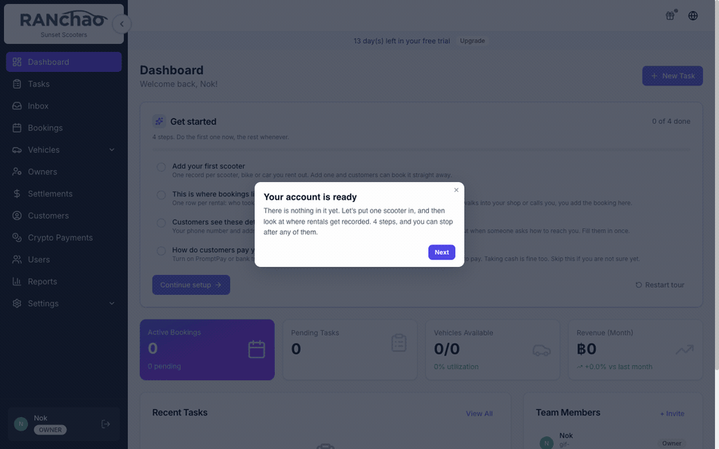
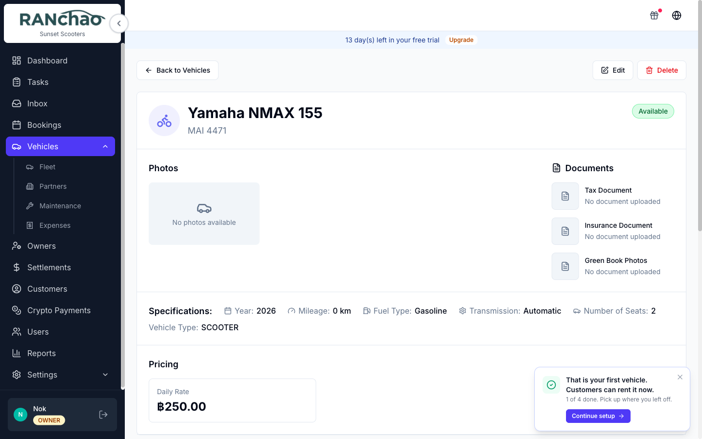

## The guided setup

A new account walks a short tour on first login: add one thing you rent out, see
where bookings live, then your contact details and how you take payment. Four
steps for a rental shop, six for trips, and you can stop after any of them.

If you leave halfway through, for example because you went off and actually
added a vehicle, a **Continue setup** bar follows you until you come back to it
or dismiss it. Resuming picks up at the next thing, not the one you just did.

The same checklist lives on the Dashboard afterwards and tracks itself from your
real data, so a step ticks off when the thing exists, not when you clicked past
it. **Restart tour** on that card runs it again.

## Who these pages are for

The person running the shop: the owner who sets it up, and the manager, agent or
employee who works in it every day.

They describe what the product does **today**, not what it is meant to do
eventually. Every page is checked against the running product, so where a screen
implies something it does not do, the page says so rather than staying quiet.
That is the whole point of writing them this way: a manual you can act on
without having to try it first.
