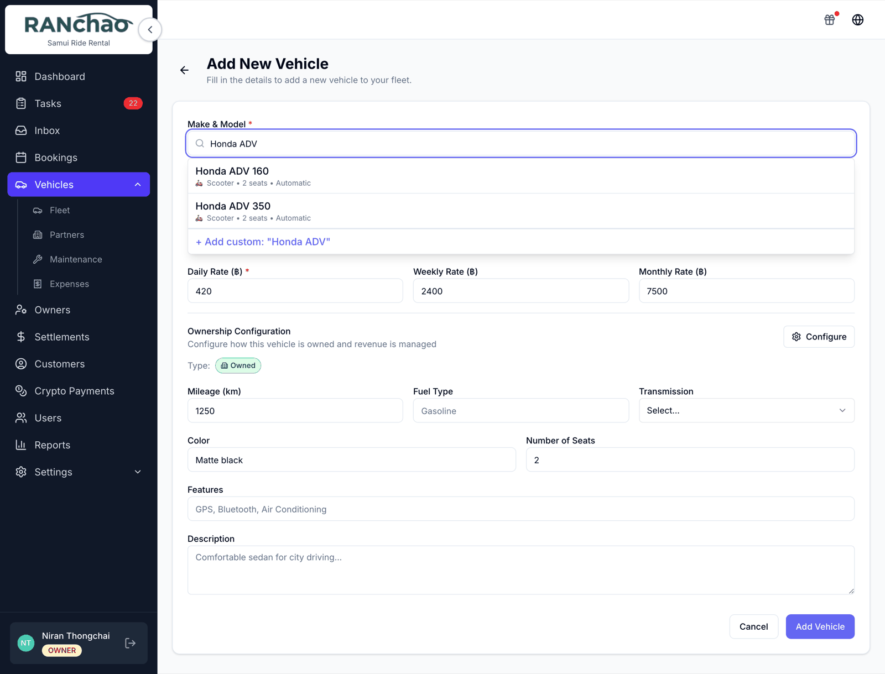
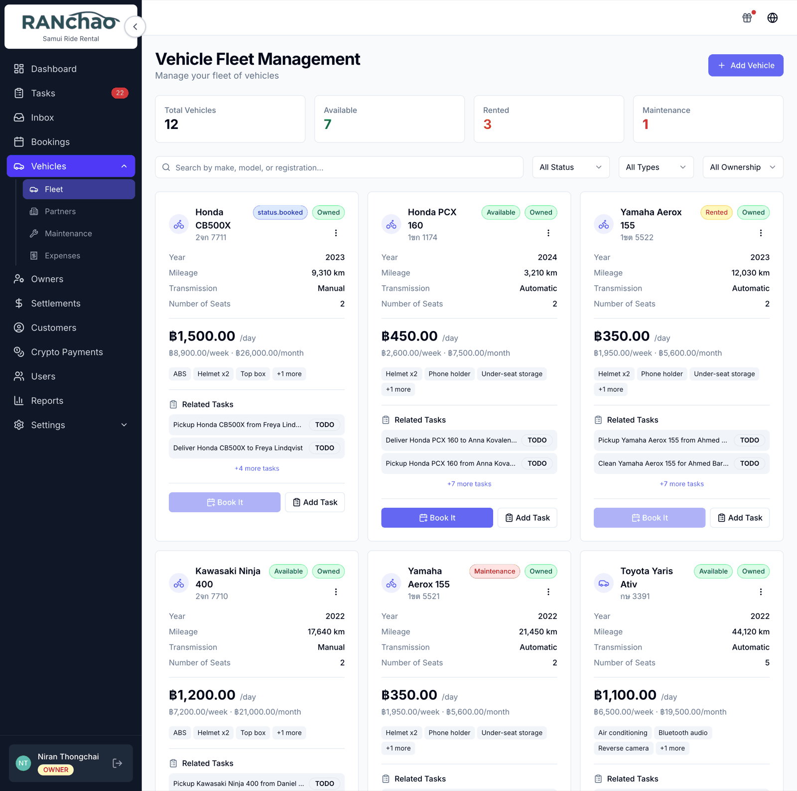
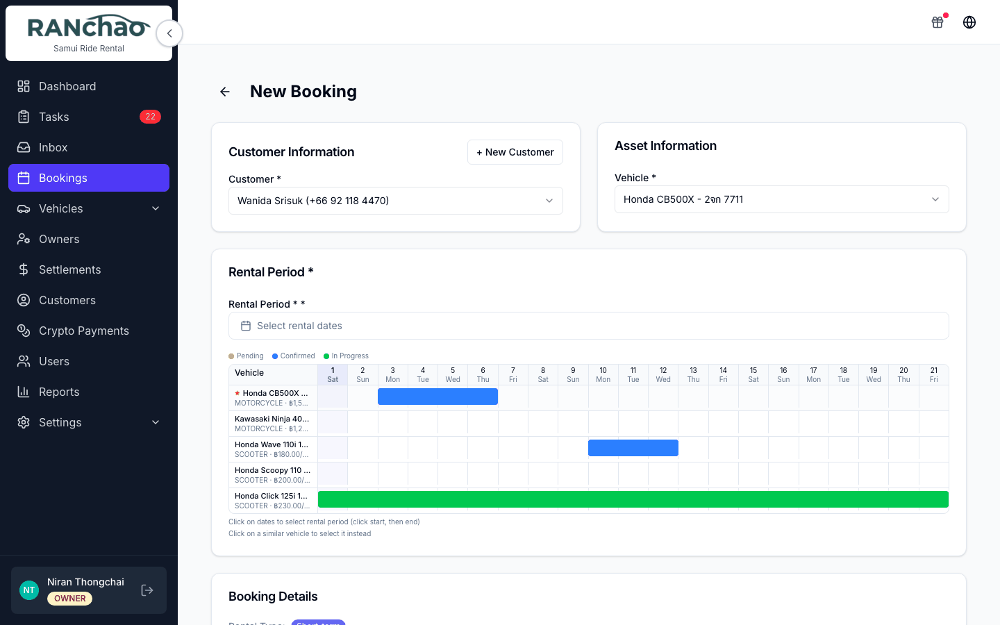
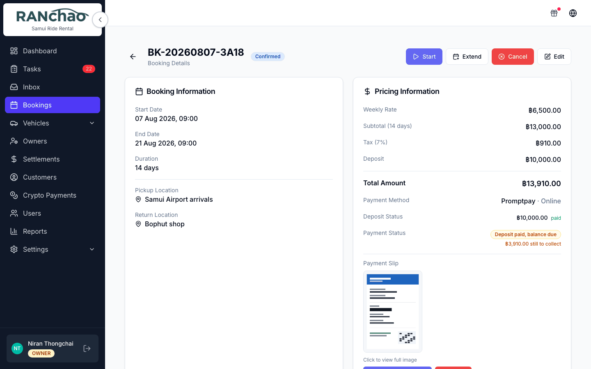
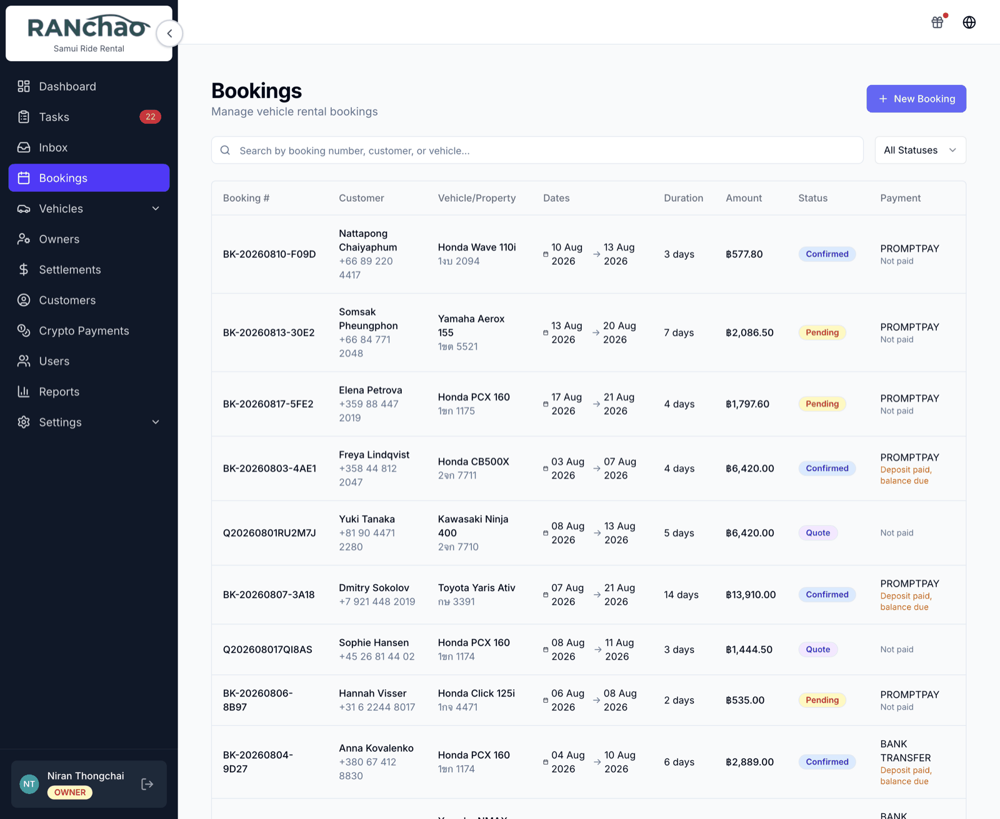
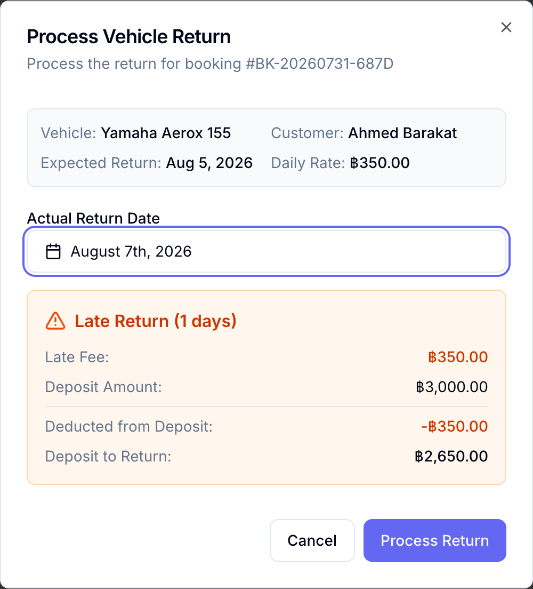
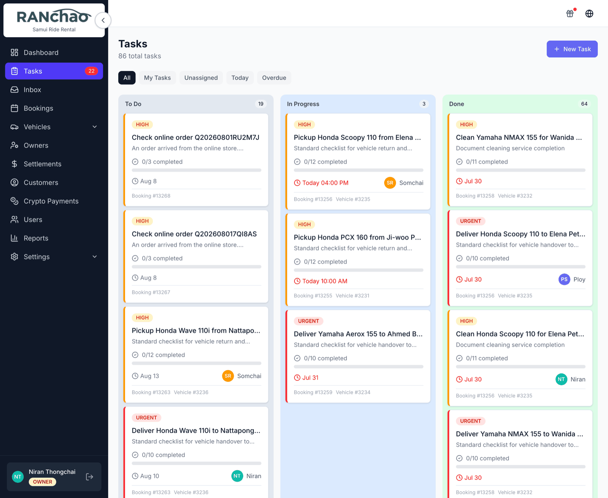
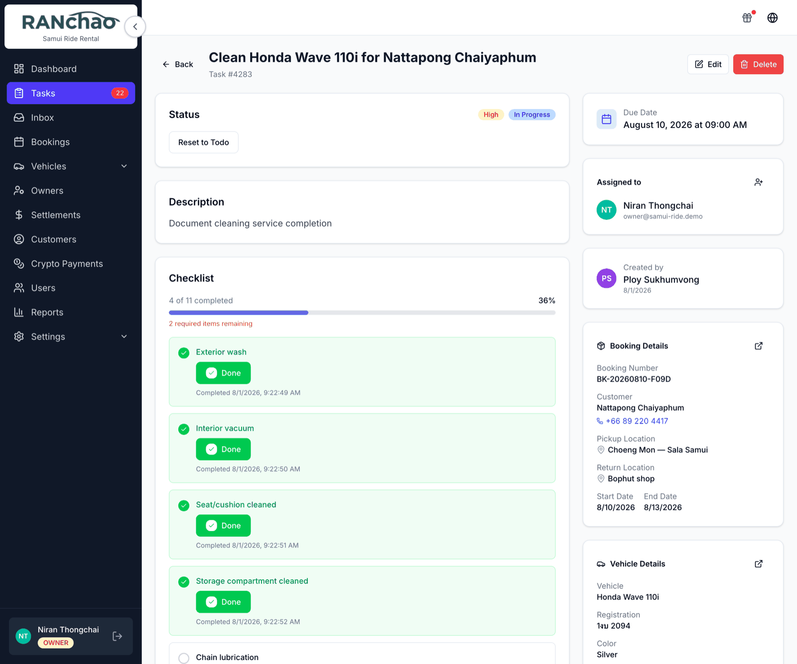

# A day with vehicle rental

Written for the **manager**: the person who opens the shop, takes the bookings
and gets the scooters out. Where a screen belongs to the owner alone, it says so,
so you know when to ask rather than hunt.

---

## Before the first day: put the fleet in

**Vehicles → Add Vehicle.**

Five things are required: brand, model, plate number, year, and the price per
day. Brand and model is a search against a catalogue — type the first letters
and pick. If your model is not there, choose the custom entry at the bottom and
type it yourself.

Everything else waits: photos, weekly and monthly rates, mileage, who owns it.
None of it stops the vehicle being bookable today.

Each vehicle carries a status — **Available**, **Rented**, **Maintenance** —
and the fleet page is where you see the shape of your day at a glance.

---

## Morning: what is on today

Open the **Dashboard** for the four numbers: active bookings, pending tasks,
vehicles available, revenue this month.

Then open **Tasks**. That is the real to-do list of the shop and where the day
is run from. On a phone it is your first tab.

---

## A customer walks in

**Bookings → New Booking.**

You need a customer before you can save, and if they are new you create them
right on this form — first name and phone are enough. Then the vehicle, the
dates, the daily rate. A deposit is optional.

Save, and the booking exists as **Pending**.

### Confirming it

Open the booking and press **Confirm**.

This is the step that matters operationally, because confirming is what creates
the work:

| Task | Priority | Due |
|---|---|---|
| Clean *(vehicle)* for *(customer)* | High | Start date |
| Deliver *(vehicle)* to *(customer)* | Urgent | Start date |
| Pickup *(vehicle)* from *(customer)* | High | End date |

Each arrives with its checklist. Which tasks appear and what they are called is
yours to change in **Settings → Task checklists**; leave it alone and you get
the three above.

**They are created with nobody attached, on purpose.** Everyone on your team
sees unclaimed work, and **starting a task claims it**, so two people cannot end
up cleaning the same scooter. Assign one yourself when you want a specific
person on it. Owners and managers also get an **Unassigned** filter for seeing
what nobody has picked up.

A booking confirmed by a payment — a card link, or crypto — creates the same
tasks. Re-confirming never duplicates them: what is already there is left alone
and only the missing ones appear.

---

## Through the day

**Start** moves a confirmed booking to In progress when the customer takes the
vehicle. **Extend** changes the dates.

**Terminate Early** shortens a rental and keeps what it replaced. It rewrites
the end date and the totals to match the shorter stay, and it remembers the
originals: the booking then reads *"Ended early on the 5th. Originally ran to
the 12th, worth ฿2,500."* That line is your answer when the customer argues
about the refund a week later.

**Process Return** closes the rental out.

It records the actual return date, works out late days and a late fee, moves the
booking to Completed or Returned late, sets the vehicle back to **Available**,
and records how much of the deposit was kept against the fee and how much goes
back.

**Cancel closes things rather than deleting them.** Open tasks are closed with a
note saying the booking was cancelled, finished ones are left alone, and unpaid
instalments are marked cancelled. An instalment already paid is never touched:
it is the record that money changed hands.

---

## Tasks, in practice

Statuses are To Do, In Progress and Done. Open a task and you get up to three
buttons: **Start Task**, **Complete Task**, and **Reset to Todo**. Complete
only lights up once every required checklist item is ticked, and ticking any
item moves the task to In Progress by itself.

Filters are All, My Tasks, Today and Overdue, plus **Unassigned** for owners and
managers. Employees see their own tasks and the unclaimed pile, which is exactly
the work they are meant to pick up.

On a phone a task becomes a wizard: location, checklist, complete.

---

## Money

Create a card payment link from the booking page and send it, or take cash and
record it in your own books. The full picture — including what reconciles itself
and what needs your eye — is in [Getting paid](getting-paid.md).

---

## The rest of the vehicle menu

- **Partners** — companies you sub-rent from or to.
- **Maintenance** — service records per vehicle.
- **Expenses** — costs per vehicle.
- **Owners** and **Settlements** — third-party owners whose vehicles you manage,
  and what you owe them.

Maintenance and Expenses are desktop screens. If your routine depends on them,
do that part at a computer.

---

## What a manager can and cannot do

You can create, edit and delete vehicles, expenses, maintenance, bookings,
owners, partners and settlements; confirm bookings; invite and deactivate staff;
and create and assign tasks.

Four things belong to the owner alone:

- **Settings**, all of it — payment methods, the online store, task checklists,
  the AI assistant.
- **Roles.** A manager can invite and deactivate agents and employees, but
  cannot create another manager or an owner, and cannot change what an existing
  person is.
- **An agent's commission.**
- **Deleting a person's account.** A manager can deactivate someone, which stops
  the login; removing the record is the owner's.

Everything else on this page, a manager can do.
