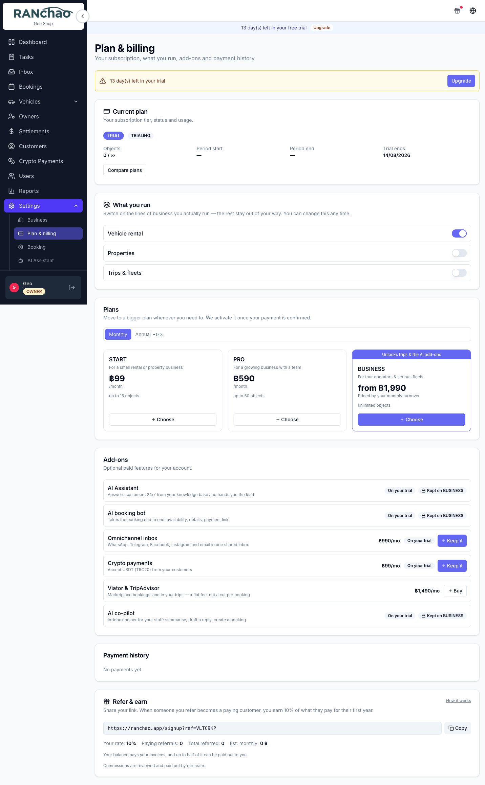
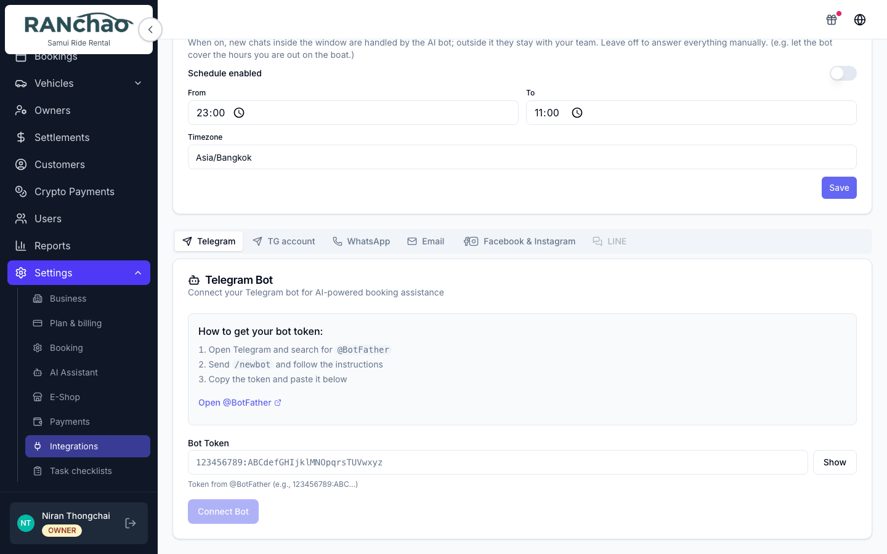

# Where do I turn that on?

A lookup table for the question people ask most. Everything in the left column
is Owner-only unless noted.

---

## Capabilities you buy

**Settings → Plan & billing → Add-ons.** Find the add-on and press **Buy**,
then pay. Something you already own gets an on/off switch instead. On a trial
the button says **Keep it**.

| I want to… | Buy | ฿/month |
|---|---|---|
| Read WhatsApp, Telegram, Facebook, Instagram and email in one place | Omnichannel inbox | 990 |
| Have a bot answer customer questions | AI Assistant | 590 |
| Have the bot also quote and take orders | AI booking bot | 790 |
| Give my staff commands while they handle a chat | AI co-pilot | 890 |
| Accept USDT | Crypto payments | 99 |
| Sell my trips on Viator | Viator & TripAdvisor | 1,490 |

The three AI add-ons need the Business plan to buy.

**Outreach campaigns (฿490) and Lead-gen monitor (฿990) are not in this list.**
Ask us and we switch them on. Both send from your own messaging accounts, so
they start with a conversation about pacing rather than a checkout.

**The AI add-ons do nothing without the Omnichannel inbox.** The assistant, the
booking bot and the co-pilot all live inside the inbox. If it is off, they are
off. The Integrations page shows an amber notice about this.

On a free trial, the inbox, both AI tiers, the co-pilot and crypto are switched
on for you. Outreach, lead-gen and Viator are not.

---

## Verticals

**Settings → Plan & billing → What you run.** Switch vehicle rental, property
rental or trips on and off. Trips needs the Business plan; the others are on
every plan. They are not exclusive.

---

## Settings, section by section

| I want to change… | Go to |
|---|---|
| Shop name, contact email and phone, address, currency | Settings → Business |
| Plan, add-ons, verticals, referral balance | Settings → Plan & billing |
| Default agent commission | Settings → Booking |
| PromptPay, bank transfer, USDT, card gateway | Settings → Payments |
| Connect WhatsApp / Telegram / email / Facebook / Instagram | Settings → Integrations |
| Bot working hours, bot on/off per channel | Settings → Integrations |
| Bot persona, goal, knowledge base | Settings → AI Assistant |
| Turn the online store on, subdomain, template, colours | Settings → E-Shop |
| The checklists on auto-created tasks, and which tasks are created at all | Settings → Task checklists |
| Destinations, boats and vans, crew | Settings → Fleet & Destinations *(trips)* |
| Trip products, prices, passenger types, guest form | Settings → Trips & pricing *(trips)* |

---

## Specific questions

**"Where do I type AI co-pilot commands?"**
Inside a conversation in the **Inbox**, in the **private note** tab, the internal
note area your customer cannot see. There is no command box anywhere in the rest
of the app. The commands are `/summarize`, `/draft`, `/book` and `/help`. Needs
the AI co-pilot add-on. See [The inbox and the AI](inbox-and-ai.md).

**"How do I stop the bot replying to this customer?"**
Set the conversation to **open**. The bot goes quiet on it and stays quiet until
somebody resolves the conversation.

**"Where is the Omise / card payment link button?"**
On a booking page, in the left column under Booking Information. It is on the phone layout too.
It only works once Omise is connected at Settings → Payments. (The menu entry
says "Payments"; the page heading says "Payment Methods". Same page.)
See [Getting paid](getting-paid.md).

**"How do customers find my online store?"**
Turn it on at Settings → E-Shop; your address is `yoursubdomain.ranchao.app` and
it is shown on that page. It publishes whatever your shop sells — vehicles,
properties and trips — and an order arriving there notifies nobody, so someone
has to watch the bookings list. It does leave a task, so it is not invisible.

**"Why can't my manager see Settings?"**
By design. Settings, Outreach and Lead-gen are owner-only.

**"Why is my employee's task list empty?"**
An employee sees only tasks assigned to them, and the tasks created when you
confirm a booking are created unassigned. Assign them.

**"Where do I add staff?"**
Users → Invite. You can invite Manager, Agent or Employee.

**"Where do I record a cash payment?"**
Two places: the paid toggle on the **Trips** page, and **Record Payment** on a
long-term booking's payment schedule. On an ordinary short rental there is no
cash button.

**"How do I stop the system creating tasks I do not want?"**
Settings → Task checklists. Each template says whether it is created
automatically and for which kind of booking. Configuring one for a booking kind
replaces the built-in set for that kind, so you get exactly what you configured.

**"Where do I print an invoice?"**
Not yet — invoices, receipts and contracts are on the roadmap. Produce them
outside the platform for now, and tell us what you need: it shapes what gets
built first. See [Getting paid](getting-paid.md).
